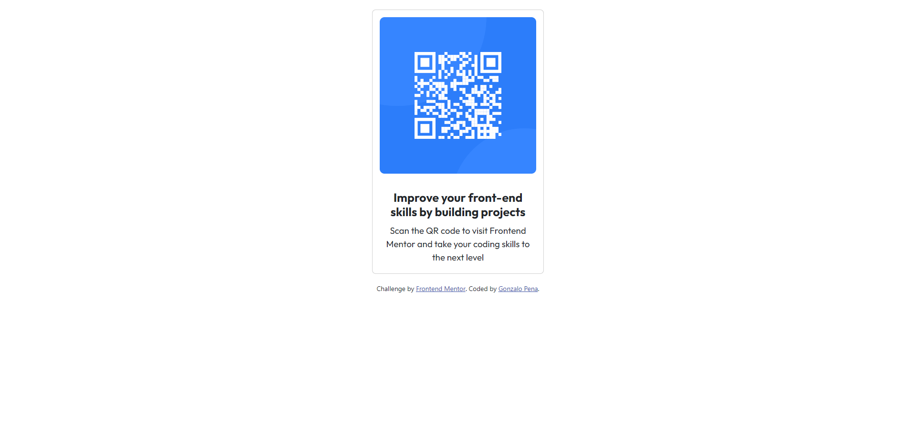

# Frontend Mentor - QR code component solution

This is a solution to the [QR code component challenge on Frontend Mentor](https://www.frontendmentor.io/challenges/qr-code-component-iux_sIO_H). Frontend Mentor challenges help you improve your coding skills by building realistic projects.

## Table of contents

- [Overview](#overview)
  - [Screenshot](#screenshot)
  - [Links](#links)
- [My process](#my-process)
  - [Built with](#built-with)
  - [What I learned](#what-i-learned)
  - [Continued development](#continued-development)
  - [Useful resources](#useful-resources)
- [Author](#author)
- [Acknowledgments](#acknowledgments)

## Overview

### Screenshot



### Links

- [Live demo](http://qr-frontend-mentor.s3-website.eu-west-2.amazonaws.com)

## My process

### Built with

- Semantic HTML5 markup
- CSS custom properties
- Flexbox
- CSS Grid
- Mobile-first workflow
- [Bootstrap](https://getbootstrap.com/) - CSS framework
- [AWS](https://aws.amazon.com/) - Cloud services

### What I learned

```html
<h1>Some HTML code I'm proud of</h1>
<div class="container">
  <div class="row"></div>
    <div class="col d-flex justify-content-center">
      <div class="card" style="width: 18rem;">
        
        <div class="card-body">
          <h5 class="card-title">Improve your front-end skills by building projects</h5>
          <p class="card-text">Scan the QR code to visit Frontend Mentor and take your coding skills to the next level</p>
        </div>
      </div>
    </div>
  </div>
</div>
```

```css
.proud-of-this-css {
  padding-top: 0.75rem;
  padding-left: 0.75rem;
  padding-right: 0.75rem;
  padding-bottom: 0.75rem;
  border-radius: 7%;
}
```

### Continued development

I want to continue focusing on React in my future projects. These are some of the concepts I am still not completely comfortable with, I really want to refine and perfect.

### Useful resources

- [Stackoverflow](https://stackoverflow.com/questions/39031224/how-to-center-cards-in-bootstrap-4) - This helped me to center the card horizontally in the middle across the page.
- [Stackoverflow](https://stackoverflow.com/questions/62322171/how-to-round-the-corners-of-a-card-body-and-image-in-bootstrap-4) - This is an amazing article which helped me finally understand how to round image corners. I'd recommend it to anyone still learning this concept.

## Author

- Website - [Gonzalo](http://gpena.co.uk)
- Frontend Mentor - [@Gonzalo6282](https://www.frontendmentor.io/profile/yourusername)

## Acknowledgments

- Udemy - [Colt Steele](https://www.udemy.com/user/coltsteele/)

I did get inspiration from Colt Steele, he is a coding instructor in Udemy. I'd recommend it to anyone that is learning programing to check some of his courses.

